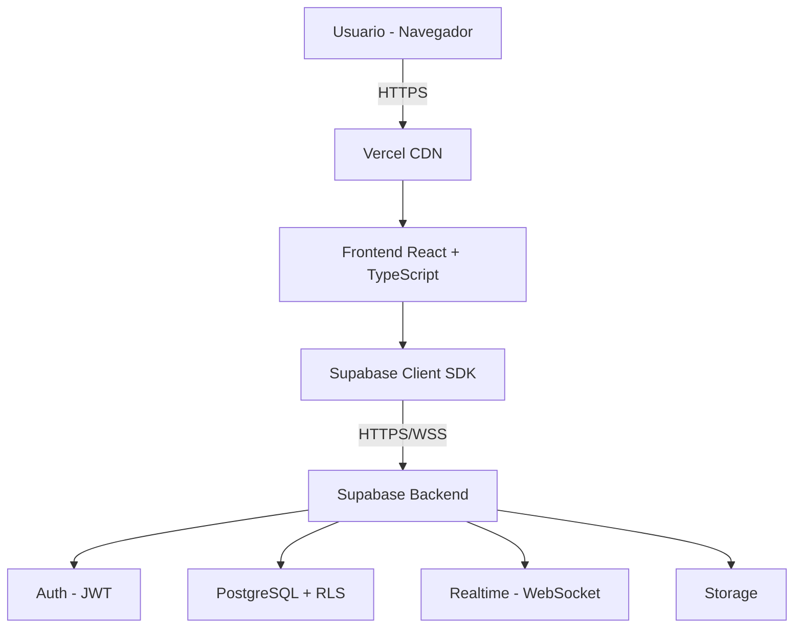
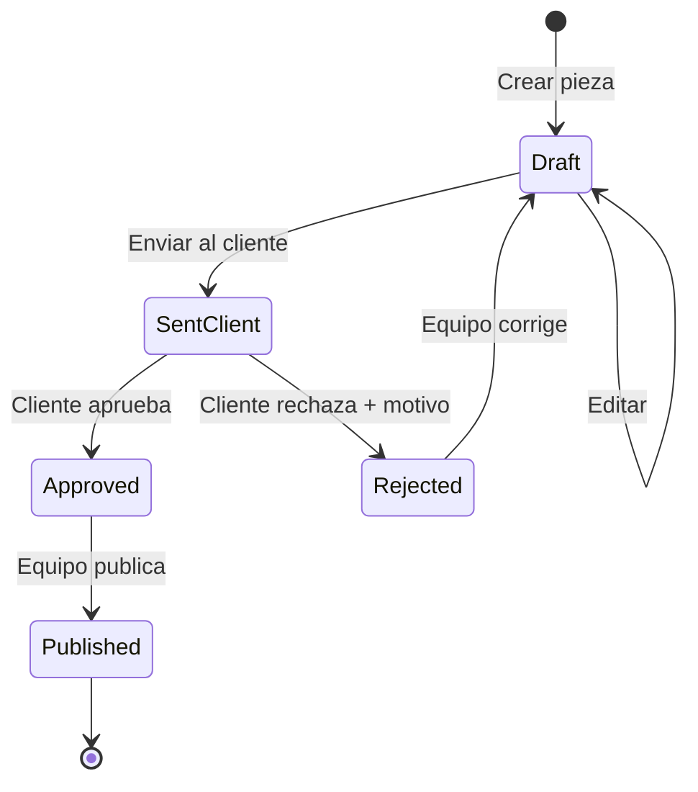

# Etapa 3 — Diagramas Detallados

## 3.1 Diagramas seleccionados

| # | Diagrama | Que representa |
|---|----------|----------------|
| 1 | Arquitectura de Componentes | Como se conectan frontend, backend y servicios externos |
| 2 | Casos de Uso | Actores y funcionalidades disponibles por rol |
| 3 | Estado de la Pieza | Ciclo de vida de la entidad principal del sistema |

## 3.2 Diagrama 1 — Arquitectura de Componentes

| Capa | Tecnologia | Responsabilidad |
|------|-----------|-----------------|
| Cliente | Navegador del usuario | Renderiza la UI, ejecuta JavaScript |
| Hosting/CDN | Vercel | Sirve los assets estaticos con cache global |
| Frontend | React + TypeScript | Logica de UI, navegacion, validaciones, estado |
| Backend | Supabase (PostgreSQL) | Persistencia, autenticacion, autorizacion |
| Realtime | Supabase Realtime | WebSockets para comentarios y aprobaciones en vivo |
| Storage | Supabase Storage | Archivos adjuntos (creativos de las piezas) |

## 3.3 Diagrama 2 — Casos de Uso

### Actores

| Actor | Descripcion |
|-------|-------------|
| Admin de Agencia | Director o socio. Tiene acceso total al sistema. |
| Miembro del Equipo | Empleado (CM, disenador, redactor). |
| Cliente Final | Usuario externo de la cuenta gestionada. |

### Tabla de casos de uso

| ID | Caso de Uso | Admin | Miembro | Cliente |
|----|-------------|-------|---------|---------|
| CU01 | Iniciar sesion | SI | SI | SI |
| CU02 | Cerrar sesion | SI | SI | SI |
| CU03 | Ver dashboard | SI | SI | — |
| CU04 | Crear cuenta-cliente | SI | — | — |
| CU05 | Editar cuenta-cliente | SI | — | — |
| CU06 | Eliminar cuenta-cliente | SI | — | — |
| CU07 | Crear miembro del equipo | SI | — | — |
| CU08 | Asignar miembros a cuenta | SI | — | — |
| CU09 | Vincular cliente a cuenta | SI | — | — |
| CU10 | Crear pieza | SI | SI | — |
| CU11 | Editar pieza en borrador | SI | SI | — |
| CU12 | Adjuntar archivos a pieza | SI | SI | — |
| CU13 | Enviar pieza al cliente | SI | SI | — |
| CU14 | Ver calendario editorial | SI | SI | — |
| CU15 | Comentar pieza | SI | SI | SI |
| CU16 | Marcar pieza como publicada | SI | SI | — |
| CU17 | Ver piezas pendientes de aprobacion | — | — | SI |
| CU18 | Aprobar pieza | — | — | SI |
| CU19 | Rechazar pieza con comentario | — | — | SI |
| CU20 | Ver calendario de su cuenta | — | — | SI |
| CU21 | Comentar pieza (cliente) | — | — | SI |

## 3.4 Diagrama 3 — Estado de la Pieza

### Estados

| Estado | Significado | Quien lo genera |
|--------|-------------|-----------------|
| `draft` | Recien creada, en edicion interna | Sistema (al crear) |
| `sent_client` | Lista para aprobacion del cliente | Miembro del equipo |
| `approved` | Cliente la aprobo | Cliente |
| `rejected` | Cliente la rechazo con motivo | Cliente |
| `published` | Ya esta en redes/medios | Miembro del equipo |

### Reglas de negocio

| Regla | Descripcion |
|-------|-------------|
| R1 | Una pieza solo puede editarse en estado `draft` |
| R2 | Solo se puede eliminar una pieza en estado `draft` |
| R3 | Para enviar al cliente, la pieza debe tener al menos un archivo adjunto |
| R4 | Al rechazar una pieza es obligatorio incluir un motivo |
| R5 | Una pieza rechazada vuelve automaticamente a `draft` |
| R6 | Solo se puede publicar una pieza en estado `approved` |
| R7 | Una pieza publicada no puede volver a ningun estado anterior |

